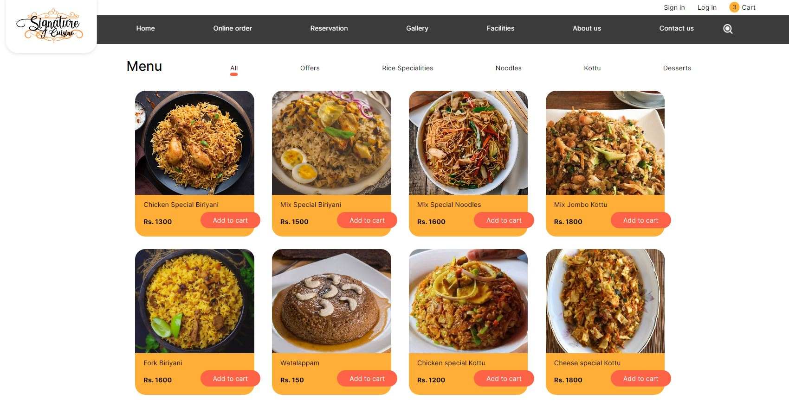

# Signature Cuisine Ecommerce Website

This project is an ecommerce website developed for the Signature Cuisine restaurant chain in Sri Lanka. It offers online food ordering, table reservations, user account management, and an admin dashboard for restaurant management.

Visit the live demo at [signature.myartsonline.com](http://signature.myartsonline.com/) for more details..

## Features

- **User Authentication:** Allow customers to sign up and sign in securely.
- **Online Food Ordering:** Browse and order food items available at Signature Cuisine.
- **Shopping Cart:** Add and manage items in the cart before checkout.
- **Customer Location Tracking:** Enable location services for better service delivery.
- **Table Reservations/Bookings:** Customers can make table reservations through the website.
- **Order and Reservation Tracking:** Users can track their orders and reservations through their accounts.
- **Contact Us Page:** Includes a contact form for customers to reach out.
- **Admin Dashboard:** A comprehensive dashboard for restaurant administration and staff.

## Technologies Used

- HTML, CSS, JavaScript
- PHP
- jQuery
- Ajax

## Architecture and Code Structure

The project follows the MVC (Model-View-Controller) architecture for clean and reusable code. The codebase is structured for easy maintenance and scalability.

## User Interface

The user interface is designed adhering to UI/UX principles. It is responsive, ensuring a seamless experience across various devices and screen sizes.

View UI design [here](https://www.figma.com/file/6aSKSGqoJ3V9Yrdt8UiGVV/Signature-cuisine?type=design&node-id=0%3A1&mode=design&t=YC3HmPichETKE6CK-1)

## Site Screenshots

Online order page

Login page

Cart page

Reservation/Booking page

Gallery page

Admin Dashboard

Dashboard orders

Dashboard reservations

## Getting Started

To run this project locally, follow these steps:

1. Clone the repository.
2. Set up a local server environment (e.g., XAMPP, WAMP, or MAMP).
3. Import the project database.
4. Configure the necessary settings (app/core/config.php) in the project files.
5. Run the application on the local server.

## Usage

- Sign up for a customer account or sign in if you have one.
- Browse available food items, add them to the cart, and proceed to checkout.
- Make table reservations through the provided interface.
- Use the account dashboard to track orders and reservations.
- Use the contact form for any inquiries or assistance needed.

## Contributors
Designed and developed by [Fathima Hasna](https://github.com/HasnaFathima-8810)

